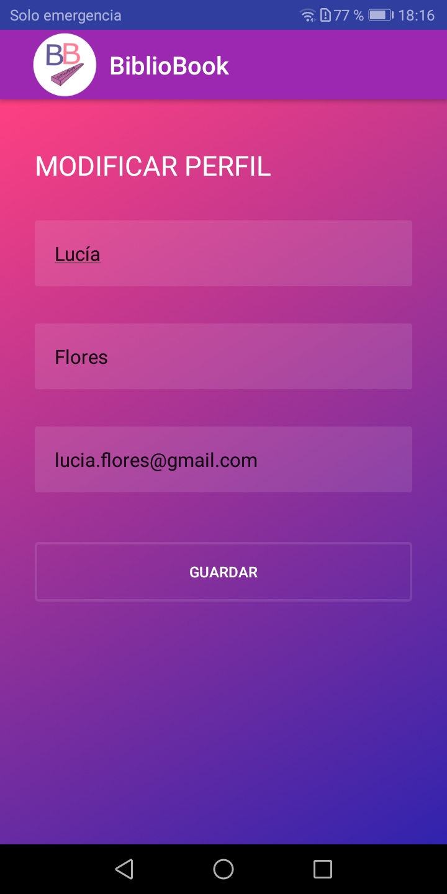

# BIBLIOBOOK android App

_BiblioBook es un aplicación sobre libros hecha en adroid nativo con la utilización de la API de Google para la asignatura de Programación Multimedia y Dispositivos Móviles del IES Campanillas._
 
## Introducción
 _El objetivo de está aplicación es que los usuarios puedan hacer una búsqueda de libros para ver su descripción, su autor y algunas características más. El usuario también puede ver sus datos y actualizarlos._
 
_A continuación voy a explicar las distintas funcionalidades y las pantallas que tiene la aplicación:_

### Login y Registro
 _Al entrar aparece el login para loguearte con un enlace al registro para registrarte si no estás registrado._

 

### Olvido de contraseña

_Si tienes una cuenta BiblioBook y te has olvidado de la contraseña puedes cambiarla en la opción de: ¿Has olvidado la contraseña? del Login_

### Lista de libros

_Al iniciar sesión se muestra una lista de libros donde se puede pulsar para ver sus detalles._

### Detalles del libro

_En la pantalla de destalles de un libro se muestra lo siguiente:_

### Búsqueda normal

_En la barra de navegación superior aparece un icono con forma de lupa que si se pulsa se puede realizar una búsqueda de cualquier libro, al pulsar enter aparecerán libros si existen en la API de Google._

### Búsqueda avanzada

_En el menú, está la opción de busqueda avanzada que al pulsar en ella aparece un formulario para introducir datos del título, del autor, de la editrial y el ISBN del libro que se quiere búscar:_

### Modificar perfil

_En el menú también hay una opción para ir al perfil, donde se pueden modificar los datos del usuario:_

### Cerrar Sesión

_Si no quieres que se quede la aplicación abierta, hay una opción para cerrar la sesión en el menú:_

